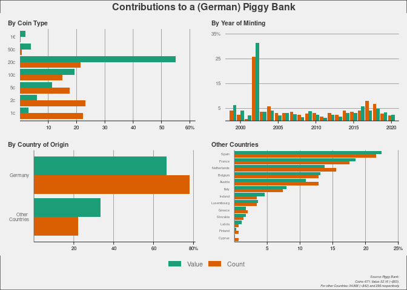
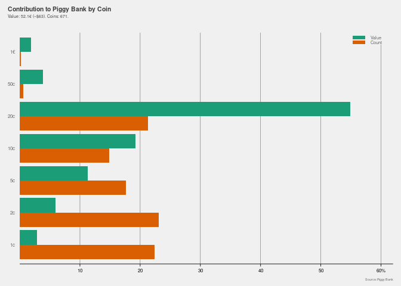
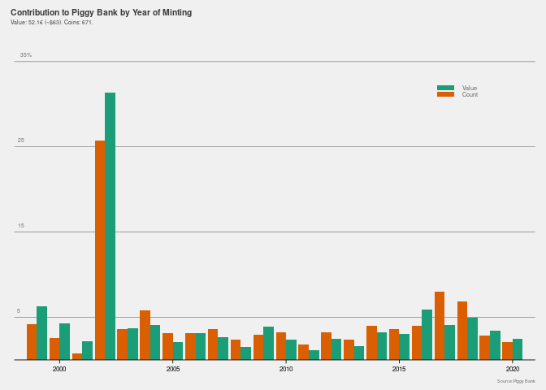
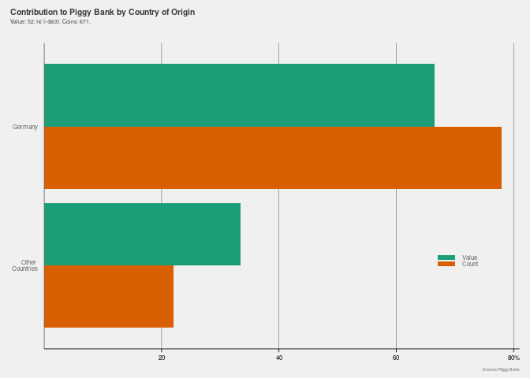
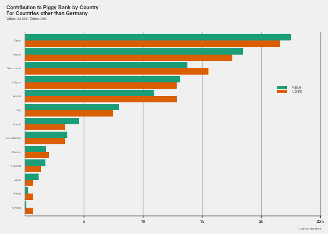

Analysis of a (German) Piggy Bank
================

## Packages

``` r
library(tidyverse)
library(ggpubr)
library(kableExtra)
```

## Theme

``` r
hp_theme <- function(base_size = 13, base_family = "") {
  theme_grey(base_size = base_size, base_family = base_family) %+replace%
    theme(
      
      # Base elements which are not used directly but inherited by others
      line =              element_line(colour = '#DADADA', size = 0.75,
                                       linetype = 1, lineend = "butt"),
      rect =              element_rect(fill = "#F0F0F0", colour = "#F0F0F0",
                                       size = 0.5, linetype = 1),
      text =              element_text(family = base_family, face = "plain",
                                       colour = "#656565", size = base_size,
                                       hjust = 0.5, vjust = 0.5, angle = 0,
                                       lineheight = 0.9, margin = margin(),
                                       debug = FALSE),
      plot.margin =       margin(12,10,5,10),
      # Modified inheritance structure of text element
      plot.title =        element_text(size = rel(0.6), family = '' ,
                                       face = 'bold', hjust = 0,
                                       vjust = 2.5, colour = '#3B3B3B'),
      plot.subtitle =     element_text(size = rel(0.4), family = '' ,
                                       face = 'plain', hjust = 0,
                                       vjust = 2.5, colour = '#3B3B3B', 
                                       margin = margin(0,0,15,0)),
      axis.title.x =      element_blank(),
      axis.title.y =      element_blank(),
      axis.text =         element_text(),
      # Modified inheritance structure of line element
      axis.ticks =        element_line(),
      panel.grid.major =  element_line(),
      panel.grid.minor =  element_blank(),
      
      # Modified inheritance structure of rect element
      plot.background =   element_rect(),
      panel.background =  element_rect(),
      legend.key =        element_rect(colour = '#DADADA'),
      
      # Modifiying legend.position
      legend.position = 'none',
      
      complete = TRUE
    )
}
```

## Read in data

``` r
raw <- read.csv("raw.csv")
```

## Create new variables

``` r
# Create value for coin / year combination
d <- raw %>% 
  rowwise() %>% 
  mutate(Count=sum(c_across(Germany:Cyprus))) %>% 
  mutate(Value = Count*Coin) 
```

## Some initial analyses

``` r
# How many coins were in the piggy bank? 
coin_count <- sum(d$Count)

# How much are the coins worth?
money_worth <- sum(d$Value)

# Average Value per coin
average <- money_worth/coin_count

# Table
analysis <-data.frame(
  Var <- c("Total Monetary Value", "Coins", "Average Value"),
  Value <- c(money_worth, coin_count, average))
names(analysis) <- c('Statistic','Value')

kbl(analysis) 
```

<table>

<thead>

<tr>

<th style="text-align:left;">

Statistic

</th>

<th style="text-align:right;">

Value

</th>

</tr>

</thead>

<tbody>

<tr>

<td style="text-align:left;">

Total Monetary Value

</td>

<td style="text-align:right;">

52.1000000

</td>

</tr>

<tr>

<td style="text-align:left;">

Coins

</td>

<td style="text-align:right;">

671.0000000

</td>

</tr>

<tr>

<td style="text-align:left;">

Average Value

</td>

<td style="text-align:right;">

0.0776453

</td>

</tr>

</tbody>

</table>

# Individual Graphs:

## By:

### Coin

``` r
coin <- d %>% 
  group_by(Coin) %>% 
  summarise(Value = sum(Value),
            Count = sum(Count)) %>% 
  mutate(Value_Percent = (Value/money_worth)*100,
         Count_Percent = (Count/coin_count)*100) %>% 
  pivot_longer(cols=c('Value_Percent', 'Count_Percent'), names_to='variable', 
               values_to="value") %>% 
  ggplot(aes(x=as.factor(Coin),y=value, fill=variable)) +
  geom_bar(stat='identity', position='dodge') +
  coord_flip() +
  scale_y_continuous(limits = c(0, 62), 
                     breaks = c(seq(10,60,10)) , 
                     expand = c(0, 0), 
                     labels=c("0"="10","20"="20","30"="30","40"="40",
                              "50"="50","60" = "60%")) +
  scale_x_discrete(labels=c("1"="1€","0.5"="50c","0.2"="20c",
                            "0.1"="10c","0.05"="5c","0.02"="2c" ,"0.01"="1c")) +
  scale_fill_manual(breaks=c("Value_Percent","Count_Percent"), 
                    values=c("#1b9e77", "#d95f02"),labels = c("Value", "Count"))  +
  labs(title = "By Coin Type") +
  hp_theme() + theme(axis.text= element_text(size=6), axis.title.x = element_blank(), 
                     plot.title.position = "plot", 
                     axis.title.y = element_blank(), 
                     panel.grid.major.x = element_line(size=.2, color="#656565"), 
                     panel.grid.major.y = element_blank(), 
                     axis.line.x=element_line( size=.3, color="black"), 
                     legend.position = c(0.88, 0.98), 
                     legend.text=element_text(size=8),
                     legend.title=element_blank(), 
                     legend.key.height= unit(0.4,"line"),
                     legend.key = element_blank(), 
                     axis.ticks.y = element_blank(), 
                     axis.ticks.x =element_line( size=.3, color="black"), 
                     axis.text.x= element_text(color="black"),
                     plot.title = element_text(size = rel(0.6)))
```

### Year

``` r
year <- d %>% 
  group_by(Year) %>% 
  summarise(Value = sum(Value),
            Count = sum(Count)) %>% 
  mutate(Value_Percent = round((Value/money_worth)*100, digits = 2),
         Count_Percent = round((Count/coin_count)*100, digits = 2)) %>% 
  pivot_longer(cols=c('Value_Percent', 'Count_Percent'), names_to='variable', 
               values_to="value") %>% 
ggplot(aes(x=Year,y=value, fill=variable)) +
  geom_bar(stat='identity', position='dodge') +
  scale_y_continuous(limits = c(0, 36), 
                     breaks = c(seq(5,35,10)), 
                     expand = c(0, 0),
                     labels=c("5"="5","15"="15",
                              "25" = "25","35"="35%")) +
  scale_x_continuous(limits=c(1998,2021),
                     expand = c(0, 0)) +
  labs(title = "By Years of Minting") +
  scale_fill_manual(breaks=c("Value_Percent","Count_Percent"), 
                    values=c("#1b9e77", "#d95f02"),labels = c("Value", "Count"))  +
  hp_theme() + theme(axis.text= element_text(size=6), axis.title.x = element_blank(), 
                     plot.title.position = "plot", 
                     axis.title.y = element_blank(), 
                     panel.grid.major.x = element_blank(),
                     panel.grid.major.y = element_line(size=.2, color="#656565"), 
                     axis.line.x=element_line( size=.3, color="black"), 
                     axis.line.y=element_blank(),
                     legend.position = c(0.9, 0.95), 
                     legend.text=element_text(size=8),
                     legend.title=element_blank(), 
                     legend.key.height= unit(0.4,"line"),
                     legend.key = element_blank(), 
                     axis.ticks.y = element_blank(), 
                     axis.ticks.x =element_line( size=.3, color="black"), 
                     axis.text.x=element_text(color="black"),
                     plot.title = element_text(size = rel(0.6)))
```

### By Countries

#### preparation

``` r
# country_df data frame
country_df <- d %>% 
  select(-c(Value,Count)) %>% 
  gather(Germany:Cyprus, key = country_df, value = Count) %>% 
  mutate(Value=Count*Coin) %>%
  mutate(Germany=0) %>% 
  mutate(Germany=replace(Germany,country_df=="Germany",1)) %>% 
  group_by(Germany)
```

#### Germany vs. Rest

``` r
germany <- country_df %>% 
  summarise(Value = sum(Value),
            Count = sum(Count)) %>% 
  mutate(Value_Percent = round((Value/money_worth)*100, digits = 2),
         Count_Percent = round((Count/coin_count)*100, digits = 2)) %>% 
  pivot_longer(cols=c('Value_Percent', 'Count_Percent'), names_to='variable', 
               values_to="value") %>% 
  arrange(desc(Germany)) %>% 
  ggplot(aes(x=as.factor(Germany),y=value, fill=variable)) +
  geom_bar(stat='identity', position='dodge') +
  coord_flip() +
  scale_y_continuous(limits = c(0, 81), 
                     breaks = c(seq(20,80,20)), 
                     expand = c(0, 0),
                     labels=c("20"="20","40"="40",
                              "60" = "60","80"="80%")) +
  scale_x_discrete(labels=c("1"="Germany","0"="Other \n Countries")) +
  scale_fill_manual(breaks=c("Value_Percent","Count_Percent"), 
                    values=c("#1b9e77", "#d95f02"),labels = c("Value", "Count"))  +
  labs(title = "By Country of Origin") +
  hp_theme() + theme(axis.text= element_text(size=6), axis.title.x = element_blank(), 
                     plot.title.position = "plot", 
                     axis.title.y = element_blank(), 
                     panel.grid.major.x = element_line(size=.2, color="#656565"), 
                     panel.grid.major.y = element_blank(), 
                     axis.line.x=element_line( size=.3, color="black"), 
                     axis.line.y=element_line( size=.3, color="#656565"), 
                     legend.position = c(0.87, 0.3), 
                     legend.text=element_text(size=6),
                     legend.title=element_blank(), 
                     legend.key.height= unit(0.4,"line"),
                     legend.key = element_blank(), 
                     axis.ticks.y = element_blank(), 
                     axis.ticks.x =element_line( size=.3, color="black"), 
                     axis.text.x=element_text(color="black"),
                     plot.title = element_text(size = rel(0.6)))
```

### Rest among Themselves

``` r
rest <- country_df %>% 
  ungroup() %>% 
  filter(country_df!="Germany") %>% 
  select(-Germany) %>% 
  group_by(country_df) %>% 
  summarise(Value = sum(Value),
         Count = sum(Count)) %>% 
  mutate(Value_Percent = round((Value/sum(Value))*100, digits = 2),
         Count_Percent = round((Count/sum(Count))*100, digits = 2)) %>% 
  pivot_longer(cols=c('Value_Percent', 'Count_Percent'), names_to='variable', 
               values_to="value") %>% 
  arrange(desc(value)) %>% 
  mutate(country_df= as.factor(country_df)) %>% 
  ggplot(aes(x=reorder(country_df, value),y=value, fill=variable)) +
  geom_bar(stat='identity', position='dodge') +
  coord_flip() +
  scale_y_continuous(limits = c(0, 25.1), 
                     breaks = c(seq(5,25,5)), 
                     expand = c(0, 0),
                     labels=c("5"="5","10"="10",
                              "15" = "15","20"="20","25"="25%")) +
  scale_x_discrete(labels=c("1"="Germany","0"="All Other")) +
  scale_fill_manual(breaks=c("Value_Percent","Count_Percent"), 
                    values=c("#1b9e77", "#d95f02"),labels = c("Value", "Count"))  +
  labs(title = "Other Countries") +
  hp_theme() + theme(axis.text= element_text(size=4), axis.title.x = element_blank(), 
                     plot.title.position = "plot", 
                     axis.title.y = element_blank(), 
                     panel.grid.major.x = element_line(size=.2, color="#656565"), 
                     panel.grid.major.y = element_blank(), 
                     axis.line.x=element_line( size=.3, color="black"), 
                     axis.line.y=element_line( size=.3, color="#656565"), 
                     legend.position = c(0.89, 0.7), 
                     legend.text=element_text(size=6),
                     legend.margin=margin(t = 0, unit='cm'),
                     legend.title=element_blank(), 
                     legend.key.height= unit(0.4,"line"),
                     legend.key = element_blank(), 
                     axis.ticks.y = element_blank(), 
                     axis.ticks.x =element_line( size=.3, color="black"), 
                     axis.text.x=element_text(color="black", size=6),
                     plot.title = element_text(size = rel(0.6)))
```

# Combine indidivual graphs

``` r
figure <- ggarrange(coin,year,germany,rest,
                    ncol = 2, nrow = 2,
                    common.legend = TRUE, legend = "bottom")

figure <- annotate_figure(figure,
                top = text_grob("Contribution to a (German) Piggy Bank", 
                                color = "#3B3B3B", face = "bold", 
                                size = 12),
                bottom = text_grob("Source: Piggy Bank \n Coins: 671. Value: 52.1€ (~$63).\n For other Countries: 34.86€ (~$42) and 296.", 
                                   color = "#3B3B3B",
                                   hjust = 1, x = 0.98, 
                                   face = "italic", 
                                   size = 4),
                )

figure <- figure +  bgcolor("#F0F0F0")
figure
```

<!-- -->

``` r
ggsave("./pics/combined.jpg",width=4, height=3)
```

# Edit individual graphs

## by coin

``` r
coin + 
  labs(title = "Contribution to Piggy Bank by Coin",
       subtitle = "Value: 52.1€ (~$63). Coins: 671.",
       caption = "Source: Piggy Bank") +
  theme(legend.text=element_text(size=5.5),
        legend.margin=margin(t = 0, unit='cm'),
        legend.position = c(0.93, 0.98),
        plot.caption=element_text(size=4))
```

<!-- -->

``` r
ggsave("./pics/by_coin.jpg",width=4, height=3)
```

## by year

``` r
year +
  labs(title = "Contribution to Piggy Bank by Years of Minting",
       subtitle = "Value: 52.1€ (~$63). Coins: 671.",
       caption = "Source: Piggy Bank") +
  theme(legend.text=element_text(size=5.5),
        legend.margin=margin(t = 0, unit='cm'),
        legend.position = c(0.85, 0.865),
        plot.caption=element_text(size=4))
```

<!-- -->

``` r
ggsave("./pics/by_year.jpg",width=4, height=3)
```

## Germany vs. Rest

``` r
germany +
  labs(title = "Contribution to Piggy Bank by Country of Origin",
       subtitle = "Value: 52.1€ (~$63). Coins: 671.",
       caption = "Source: Piggy Bank") +
  theme(plot.caption=element_text(size=4))
```

<!-- -->

``` r
ggsave("./pics/germany_vs_rest.jpg",width=4, height=3)
```

## Rest

``` r
rest + 
  labs(title = "Contribution to Piggy Bank by Country \nFor Countries other than Germany",
       subtitle = "Value: 34.86€. Coins: 296.",
       caption = "Source: Piggy Bank") +
  theme(plot.caption=element_text(size=4))
```

<!-- -->

``` r
ggsave("./pics/rest.jpg",width=4, height=3)
```
